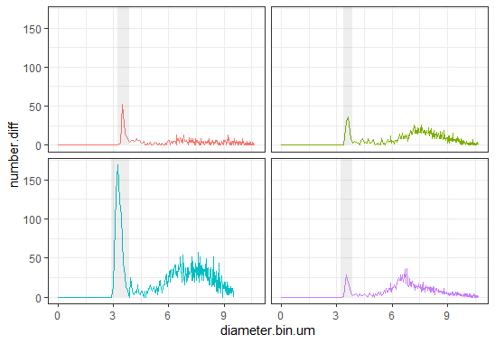

# coulteR

This package provides functions for importing data from the Z2 Coulter Counter into R. The aim is to make datasets generated with [AccuComp](https://www.beckman.de/flow-cytometry/software/383550) usable in R.
First, per-sample datasets are exported into a readable format (.xls) using `AccuComp`. Next, these untidy datasets are parsed for semantic table boundaries. Lastly,  individual tables are extracted into tidy dataframes.

## Installation

Install from GitHub:

``` R
devtools::install_github("lmuenter/coulteR")
```

## Basic Usage
In this demonstration, we will extract the `summary` module from our AccuComp-tables. Per sample, this module provides an overview over general statistics of the experiment.

``` R
# load package
library(coulteR)

# set the path to your files
exp_dir = "data/z2/"

# load all summarise
summaries.df bulk_read(exp_dir, module = "summary")
```

We can then extract e.g. the mean particle size for our datasets.
``` R
means.df = summaries.df %>%
  filter(var == "Mean") %>%  # retain only mean particle size
  select(-var)               # optional: delete column `var`
```

## Peak detection and selection
In addition to oberall sample statistics, `AccuComp`-datasets contain binned measurements of particle size. When a non-uniform distribution of particle sizes is present, e.g. with axenic cultures or coagulated cells, peak detection can be used to extract values (diameter and number of particles) for a specific peak. `{coulteR}` can be used this.
``` R
# Approximate diameter of target organisms (here in um)
diameter = 3

# extract the module `measurements` for each dataset
measurements.df = bulk_read(exp_dir, module = "measurements")

# Detect all peaks of the approximate target size
measurements.peaks = bulk_peak_detect(measurements.df, diameter = diameter)

```
The latter dataframe contains information about the location of the peak, its range, as well as the number of cells within its curve.
We can now go on and plot our tracks with highlighted target peaks.

``` R
ggtrack(measurements.df, measurements.peaks, N = 4, show.legend = FALSE)

```


## Options
When using `coulteR::read_accucomp()`, other modules can be imported by specifying the parameter `module`. These are:

|module |content |value
--- | --- | ---
|`all`|All modules|A `list` of `dataframes`
|`settings`|Experimental setup (device, duration, aperture etc.)|A two-column `dataframe`
|`summary`|Summary Statistics of the sample (e.g. Mean Particle Size)|A two-column `dataframe`
|`sizes_absolute`|Size Distribution|A two-column `dataframe`
|`sizes_summary`|Another Size Distribution|A two-column `dataframe`
|`volumes` |Cell Volume (fL)|A two-column `dataframe`
|`measurements`|Measurement Distribution(binned)|A 7-column `dataframe`

